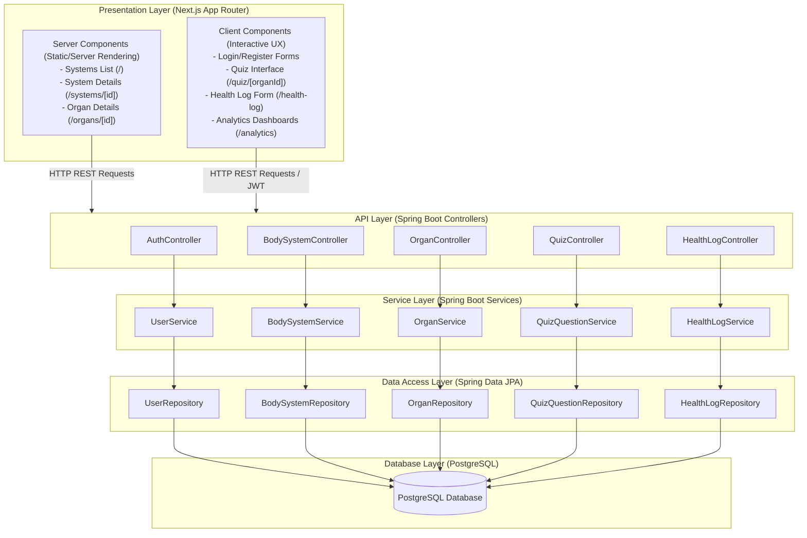

# System Architecture - AnatomyIQ

AnatomyIQ utilizes a classic layered architecture with a modern, decoupled frontend and backend stack.

## Architecture Diagram

The diagram below details the interaction flow from user-facing components down to the relational database:

## Layer Explanations

1. **Presentation Layer (Next.js)**: Responsible for rendering the user interface and handling routing. Next.js App Router uses **Server Components** for performant server-side data fetching and static optimization (e.g. browsing body systems and organ details) and **Client Components** for stateful page interactions (e.g., answering quiz questions, logging health parameters, authentication forms).
2. **API Layer (Spring Boot Controllers)**: REST controllers expose endpoints to process HTTP request actions, handle CORS, and secure resources via JWT token validation.
3. **Service Layer (Spring Boot Services)**: Houses business logic, manages transaction boundaries, and coordinates between controller requests and data access rules.
4. **Data Access Layer (Spring Data JPA)**: Provides interfaces that abstract database queries away via JPA/Hibernate implementations, mapping database records straight into Java Entity domain models.
5. **Database Layer (PostgreSQL)**: Serves as the persistence engine, housing structural data tables with clean schema constraints and relations.
