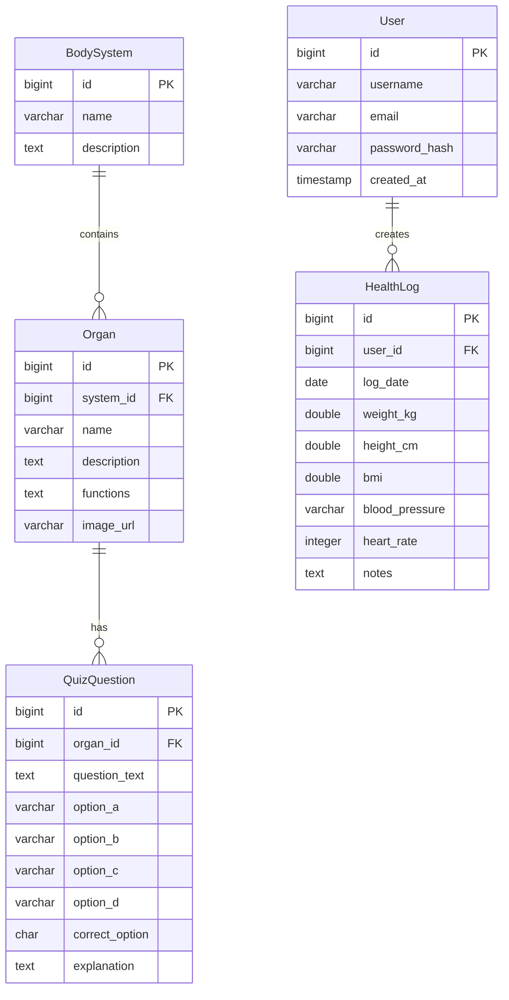

# Database Design (ER Diagram) - AnatomyIQ

This document defines the database entities and relationships for AnatomyIQ.

## Entity Relationship Diagram

## Entity Descriptions

1. **User**: Represents registering learners.
   - `id`: Unique identifier (Primary Key, auto-incrementing).
   - `username`: Unique username.
   - `email`: Unique email address for registration/login.
   - `password_hash`: Secure hashed password storage.
   - `created_at`: Account creation timestamp.
2. **BodySystem**: Represents human body systems (e.g., Circulatory, Nervous, Skeletal).
   - `id`: Unique identifier (Primary Key).
   - `name`: Name of the system.
   - `description`: Overview description of the system's role.
3. **Organ**: Represents organs belonging to a specific BodySystem.
   - `id`: Unique identifier (Primary Key).
   - `system_id`: Foreign Key referencing `BodySystem`.
   - `name`: Organ name (e.g., Heart, Brain, Stomach).
   - `description`: Anatomical/physiological description.
   - `functions`: Bullet-points or details of primary tasks.
   - `image_url`: Optional storage location of anatomical illustration.
4. **QuizQuestion**: Test questions mapped to specific organs to reinforce learning.
   - `id`: Unique identifier (Primary Key).
   - `organ_id`: Foreign Key referencing `Organ`.
   - `question_text`: Text of the multiple-choice question.
   - `option_a` to `option_d`: Available options.
   - `correct_option`: The right answer identifier ('A', 'B', 'C', or 'D').
   - `explanation`: Contextual response explanation shown to the learner.
5. **HealthLog**: A user tracker for logging body metrics (e.g., weight, height, computed BMI).
   - `id`: Unique identifier (Primary Key).
   - `user_id`: Foreign Key referencing `User`.
   - `log_date`: Date the entry was recorded.
   - `weight_kg`: Weight in kilograms.
   - `height_cm`: Height in centimeters.
   - `bmi`: Calculated Body Mass Index ($weight\_kg / (height\_m)^2$).
   - `blood_pressure`: Reading formatted as Systolic/Diastolic.
   - `heart_rate`: Beats per minute.
   - `notes`: Short descriptive text/journal log.
