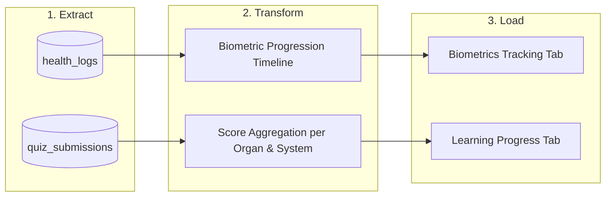

# AnatomyIQ Data Pipeline (Phase 4 - ETL Process)

This document describes the design and implementation of the Phase 4 Data Pipeline for AnatomyIQ. It enables data-driven physiological and academic feedback by extracting raw logs and submissions from the database, performing transformations on the data, and loading the resulting structures to feed the Analytics dashboard.

---

## 1. Pipeline Architecture (ETL)

The pipeline follows a classic **Extract, Transform, Load (ETL)** pattern:

---

## 2. Extraction Phase (Extract)

Raw data is extracted from the relational tables in PostgreSQL:
* **Source Tables**:
  - `health_logs`: Stores user logs including weight, height, computed BMI, blood pressure, heart rate, and date.
  - `quiz_submissions`: Stores records of quiz attempts containing the user ID, organ ID, score percentage, and completion timestamp.
* **Extraction Strategy**:
  - REST endpoints query the Spring Boot repository layer:
    - `GET /api/health-logs`: Pulls logs for the authenticated user, sorted in descending chronological order (reversed on client side to show progress forward).
    - `GET /api/quiz/history`: Pulls all historical quiz attempts for the authenticated user, sorted in ascending chronological order.

---

## 3. Transformation Phase (Transform)

Data transformation occurs dynamically to prepare raw database rows for presentation:

### 3.1. Biometrics Progression Timeline
- **Raw Data**: Multiple logs containing `weightKg`, `heightCm`, `bmi`, `logDate`, and `heartRate`.
- **Transformation**:
  - **BMI Trend**: Extracts dates and BMI metrics to calculate progression over time.
  - **Weight Trend**: Extracts dates and weight metrics to map physical progression over time.
  - **Heart Rate Trend**: Filters out null heart rate values and maps active heart rate recordings chronologically.

### 3.2. Quiz Performance Aggregation
- **Raw Data**: Flat quiz submissions containing `scorePercentage`, `organName`, and `systemName`.
- **Transformation**:
  - **Average Score per Organ**: Groups quiz submissions by organ name and computes:
    $$\text{Average Score}_{\text{Organ}} = \frac{\sum \text{scorePercentage}}{\text{number of attempts}}$$
  - **Average Score per System**: Groups quiz submissions by the parent system name (e.g. Cardiovascular System, Nervous System) and computes:
    $$\text{Average Score}_{\text{System}} = \frac{\sum \text{scorePercentage}}{\text{number of attempts}}$$
  - **Performance Trend**: Maps scores chronologically over time to visualize learning improvement.

---

## 4. Loading Phase (Load)

The transformed structures are loaded into state hooks and rendered as high-fidelity interactive charts in the **Analytics Dashboard** via Next.js and Recharts:

### 4.1. Biometrics Tracking Tab
- **Body Mass Index (BMI) Trend**: A LineChart tracing chronological body mass index values.
- **Weight Progression (kg)**: A LineChart tracking weight changes.
- **Heart Rate History (bpm)**: A LineChart visualizing cardiovascular logs.

### 4.2. Learning Progress Tab
- **Quiz Score Trends over Time**: A LineChart mapping the score percentages of successive quiz attempts.
- **Average Score by Organ (%)**: A BarChart comparing performance across individual organs.
- **Average Score by System (%)**: A BarChart comparing performance across broader physiological systems.
